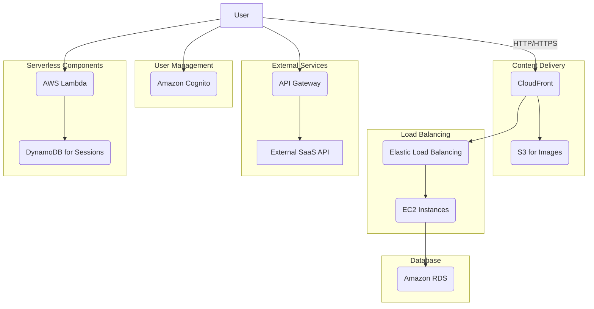

# DevOpsCenter について

- スライド:https://powerninja.github.io/chatGPT-Salesforce/ja/index
- リポジトリ:https://github.com/powerninja/chatGPT-Salesforce

```mermaid
graph TD
  User -->|HTTP/HTTPS| CF
  CF --> S3
  CF --> ELB
  ELB --> EC2
  EC2 --> RDS
  User --> AGW
  AGW --> ExternalAPI
  User --> Cognito
  User --> Lambda
  Lambda --> DynamoDB
  
  subgraph "Content Delivery"
    CF(CloudFront)
    S3(S3 for Images)
  end

  subgraph "Load Balancing"
    ELB(Elastic Load Balancing)
    EC2(EC2 Instances)
  end

  subgraph "Database"
    RDS(Amazon RDS)
  end
  
  subgraph "External Services"
    AGW(API Gateway)
    ExternalAPI[External SaaS API]
  end
  
  subgraph "User Management"
    Cognito(Amazon Cognito)
  end

  subgraph "Serverless Components"
    Lambda(AWS Lambda)
    DynamoDB(DynamoDB for Sessions)
  end

```
