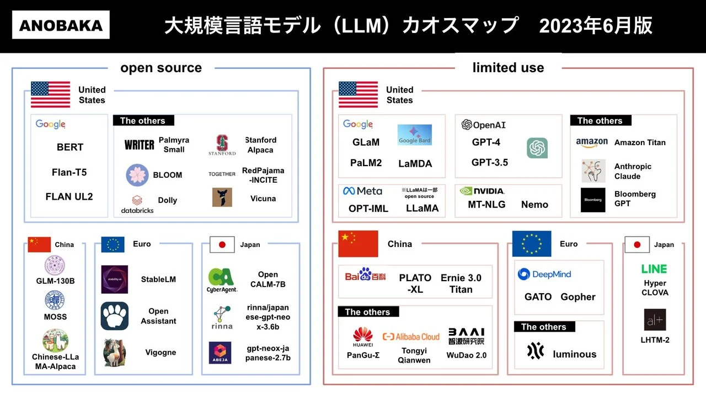

<!-- _paginate: false -->
<!-- theme: gradient class: blue-->
<!-- theme: freud class: blue-->

# Salesforce と 生成 AI について <!-- fit -->

</br>
</br>


##### スライド:https://powerninja.github.io/chatGPT-Salesforce/ja/index

##### リポジトリ:https://github.com/powerninja/chatGPT-Salesforce

---

# 前提

- ChatGPT や Einstein GPT の詳細の内容については無学のためお話しできません
- 進化の早い分野なので、ここで触れた内容は短期間のうちに変わる可能性があります
- 6 月に行われた勉強会「**[2023-06 生成 AI 〜次世代ググる活用法](https://ksaitou.gitlab.io/2023-06_generativeai/)**」を参考にさせていただいてます

---

# はじめに

#### 今回の話すこと

- 生成 AI の基本情報
- 生成 AI の問題点
- **Salesforce と 生成 AI**

---

# トピックス

1. 生成 AI とは
2. 生成 AI の種類
3. 生成 AI 使用時のポイントと問題点
4. Salesforce 実装時の活用事例
5. Salesforce との融合(demo)

---

# 生成 AI とは

- 言語についての超巨大学習モデルを LLM (Large Language Model) という
  - 話題の ChatGPT は LLM を使っている
  - [カオスマップ](https://digital-shift.jp/flash_news/FN230607_3)
    

---

# 生成 AI とは

- 特に明確な定義はないが自ら新しいデータを作成するような AI の総称
  - 新しく文章やコードを作る
  - 新しく絵・動画を作る
- データを認識・分析・分類する AI とは対照的
  - Salesforce 目線だと、レコードの分析ではなくメールの返信内容の生成や、ChatBot の機能で有効だと感じる
- 最近になって、**実用に耐える精度** のものが出てきて話題になっている
  - 人間しかできないと思われていた高度なタスクについて、予想外にうまく AI が代替してしまう可能性が見えてきて（StableDiffusion / ChatGPT）驚きを与えている状況

---

# 生成 AI の種類

## ChatGPT

- https://chat.openai.com/
- OpenAI が開発した AI 言語モデル(GPT)をチャット AI インタフェースにしたサービス (概要)
- AI モデルを選べる
  - GPT-3.5: 無料 速い
  - GPT-4: 有料 ($20/月) 生成速度が遅い＆一定時間内の呼び出し回数制限があるが、かなり内容が的確
- 知識は 2021 年 9 月 時点のもの
- ほか有料ユーザー向けにプラグイン機能や Bing との連携機能もある

---

# 生成 AI の種類

## ChatGPT を使ってみよう

### 質問文

- Salesforce の Apex にて、取引先の重複をチェックするコードを作成してください。重複をチェックする項目は名前と電話番号とメールアドレスのどれかが一致していた場合重複とします。
  - [GPT3.5](https://chat.openai.com/share/7745d22b-fdfd-4c26-898e-5e18ddd7566f)
    - 重複精査を行う処理を返してくれました
  - [GPT4](https://chat.openai.com/share/a42e1ee7-fbec-4253-ae1e-d137d4332b4c)
    - 重複精査処理+重複精査処理を呼び出す想定の Apex Trigger まで返してくれました。

---

# 生成 AI の種類

## ChatGPT を使ってみよう

- 知識が 2021 年 9 月で止まっているため、最新のニュースの取得などは不可能
  - ただしプラグインを使用することで web から情報を取得することができる

```
質問文：今日のニュースを教えて
```

```
返答：申し訳ありませんが、
私の知識は 2021 年 9 月までのものであり、
それ以降の特定の日付のニュースを提供する能力はありません。
しかし、私はあなたが質問について理解するのを助けることができます。
具体的な情報を探している場合、それについて詳しく教えていただけますか？
```

---

# 生成 AI の種類

## OpenAI API(ChatGPT の API)

- ChatGPT の API 版なので他サービスに組み込むことができる
- 料金はトークンあたりの料金
  - 1 トークンあたり$0.0004~$0.0200
  - トークンの説明は省きますが、英語で検索する方が少なくてすみます
- Apex やフローを使って OpenAI API に接続することもできる
  - 後半でデモをお見せします

---

# 生成 AI の種類

## ChatGPT 以外には？

- [Google Bard](https://bard.google.com/?hl=ja)
  - 無料で使える
  - GPT4 モデルに比べると結果は良くない
- [Bing AI](https://www.microsoft.com/ja-jp/bing)
  - Edge でのみ使用可能
  - 検索エンジンに AI の機能が追加されたようなイメージ
  - 今後は Cortana の代わり？

---

# 生成 AI 使用時のポイントと問題点

1. 倫理に反する内容等は生成できない
   - 機能に取り込んだ際に悪用されないようになっている
   - 例：Windows10 のライセンスキーを生成してくださいなど
2. AI が **一度に把握できるトークン数に制限** がある
   - ずっと話しかけていくと過去の内容を忘れていく
   - 話しかければかけるほど生成 AI が導き出す答えの幅が増えてしまうため
3. 日本語より英語の方が正確に返答される
   - トークン数も増える
   - 解答によっては英語で収集した事実を日本語に翻訳して返す場合もある

---

# 生成 AI 使用時のポイントと問題点

4. モデルのベースが古い
   - Salesforce の不明点を聞いた際に廃止された機能を薦められる可能性がある
5. 知ったかぶりをされる
   - 幻覚 (Hallucination) と呼ばれる現象
   - わからない、知らないと返答せずにそれっぽい答えを返答する場合がある
6. 入力した質問文は学習のため使用される可能性がある
   - 「下記顧客データを一覧にまとめて」などは NG
   - 今後自社サーバーなどでオープンソースの LLM を動かすことができれば解決できそう

→ **生成 AI の解答を見極めるための知識が必要となる**

---

# Salesforce 実装時の活用事例

## 標準機能の質問はあまり向いていない?

- 質問：salesforce の検索レイアウトが 1 つも表示されません。理由がわかりますか？
- [回答](https://chat.openai.com/share/d6a019a4-1401-4b02-93f8-43058862c130)：権限や設定、Salesforce のバージョンが原因の恐れがあるため確認してと返答されました
  - **実際の原因はタブを追加していないのが原因でした**
- 当たり前ではありますが、フローのアドバイスを聞いても正確の返答はされません
  - 先ほどと同じ質問の先頭をフローに変更した場合 Apex で代替された
  - [回答](https://chat.openai.com/share/aabcd5e1-9b83-47fd-aae0-8ccba0c4fcc6)

---

# Salesforce 実装時の活用事例

## 生成系 AI で返答できるコーディング系であれば強い

- 入力規則
  - 入力規則は使用頻度が高いためおすすめ
  - ただし、出力された内容をしっかりテストする必要がある
  - また、質問時に顧客に関連する内容をマスキングして質問する必要あり
- Apex

```
質問：salesforce の数式にて、作成時のフェーズを固定させたいです。
特定のフェーズ以外が選択され、作成ボタンを押下した際にエラーで弾く入力規則を教えて
```

```
AND(
  ISPICKVAL(Phase__c, "特定のフェーズ以外の値"),
  ISCHANGED(Phase__c)
)
```

---

# 開発者コンソールでできること

ログの確認方法

1. ガバナ制限の一覧が表示される
2. デバッグレベルによって、表示が変更される
3. Debug Only：debug ステートメントのみ表示される
   Filter：検索([8]のように記載することで行数検索可能)
   

---

# 開発者コンソールでできること

### ログレベルの変更方法(開発者コンソールで行う場合)

1. Debug → Change Log Levels を開く
2. General Trace Settings for You の「Add/Change」を押下
3. 変更したいデバッグレベルを選択する
   

---

# 開発者コンソールでできること

自分の **Apex コードをテストして、エラーがないことを確認**する

1. Test → New Run を開く
2. 対象のテストクラスと実行するメソッドを選択
3. 実行したテストクラスで通った箇所、カバレッジ率を確認可能


---

# Apex コードの実行

### 1. Apex クラスの動作確認(ログも確認可能)

### 2. レコードの取得・作成・更新・削除(SOQL と DML 操作)

### 3. Apex クラスではなく、Apex コードを記載し匿名で実行する

---

# Apex コードの実行

ご自身の Dev 環境などでお試しください

1. Debug → Open Execute Anonymous Window を押下(または ctrl + E, cmd + E)
2. Enter Apex Code というウィンドウが開きます


---

# Apex コードの実行

3. Enter Apex Code に下記コードを入力し、Execute を押下
4. 取引先に test が作成される
   ※SOQL は Query Editor でも実行可能

```Java
    Account act = new Account();
    act.Name = 'test';
    insert act;
    //作成した取引先のIdがログに表示される
    System.debug(act.Id);

    Account resultAct = [SELECT Id, Name FROM Account WHERE Id = :act.Id];
    //作成した取引先をSOQLで取得し、IdとNameを表示する
    System.debug(resultAct);
```

---

# Apex コードの実行

## Apex バッチの起動

- スケジュールしていない時でも、任意でバッチの呼び出しが可能

```java
//呼び出すバッチをインスタンス化
AccountBatch ab = new AccountBatch();
//バッチを起動(200はバッチサイズ)
Database.executeBatch(ab, 200);
```

---

# Apex コードの実行(おまけ)

- 先ほど試したコードを Apex クラスにすると下記

```java
public without sharing class AccountController {
  public static void createAccount(){
      Account act = new Account();
      act.Name = 'test';
      insert act;
      //作成した取引先のIdがログに表示される
      System.debug(act.Id);

      Account resultAct = [SELECT Id, Name FROM Account WHERE Id = :act.Id];
      //作成した取引先をSOQLで取得し、IdとNameを表示する
      System.debug(resultAct);
  }
}
```

- 下記 Apex コードを実行し、Apex クラスを起動する

```java
AccountController.createAccount();
```

---

# vsCode との比較

| 機能                                | 開発者コンソール | vsCode |
| ----------------------------------- | ---------------- | ------ |
| Apex,Aura,Visualforce の作成,更新   | △                | ◎      |
| デバッグの確認                      | ◯                | △      |
| Apex のテスト実行                   | ◯                | ◯      |
| SOQL,SOSL の実行 (クエリエディター) | ◯                | △      |
| Apex コードの実行(匿名実行)         | ◯                | △      |

※ LWC の作成、更新やメタデータの管理は開発者コンソールでは不可

---

# まとめ

- Apex や Visualforce を実際に記載する際は、vsCode の方が扱いやすい
- ただ、Apex を匿名実行したい場合や、SOQL クエリを使いたい場合は開発者コンソールの方が楽に実行ができる
